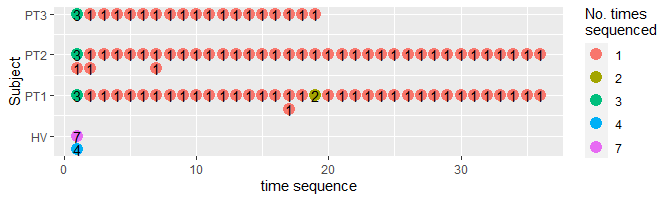
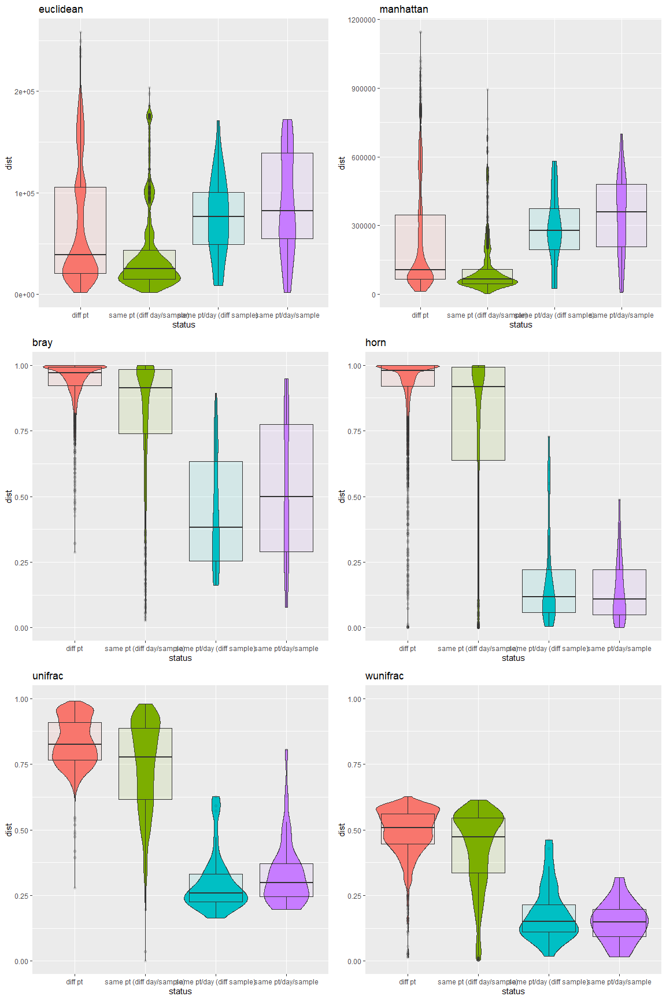
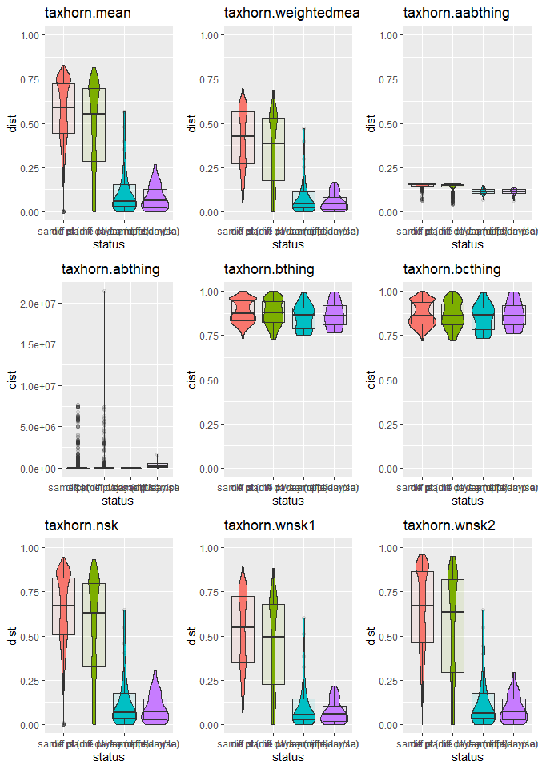
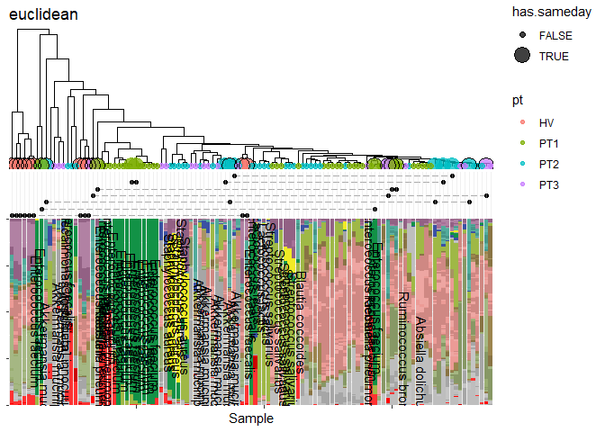
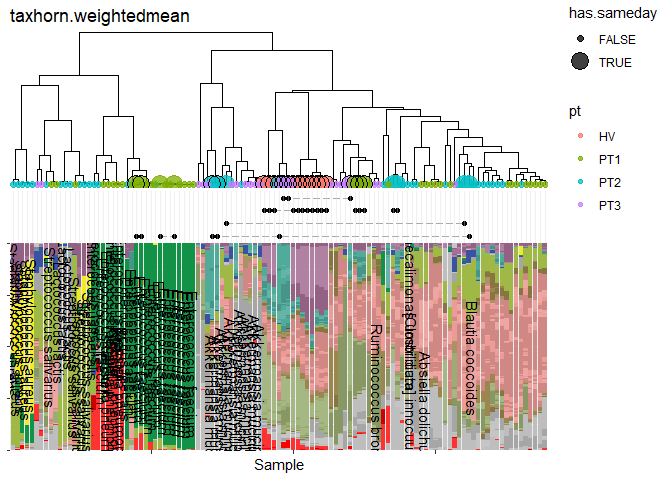

Slamka taxdist project
================

## Prepare data

We examined 113 samples, collected from a healthy volunteer (`HV`), and
3 cancer patients undergoing cancer treatment (`PT1`, `PT2`, `PT3`). In
each subject, multiple samples were collected.

| pt  | n.samples |
|:----|----------:|
| HV  |        11 |
| PT1 |        40 |
| PT2 |        41 |
| PT3 |        21 |

Subjects and number of samples

Each subject’s samples were collected on different days, but also
collected on the same day. Some samples were also sequenced multiple
times.

By selecting all possible pairwise combinations of the sequencing data,
we generated various types of two-sample comparisons:

1.  Samples from 2 different subjects.

2.  Samples from the same subject, but at 2 different timepoints.

3.  2 samples taken from the same patient and same day.

4.  2 sequencing runs of the same sample.

<!-- -->

    # A tibble: 4 × 2
      `Pairwise comparison type`     n
      <chr>                      <int>
    1 diff pt                     4463
    2 same pt (diff day/sample)   1794
    3 same pt/day (diff sample)     34
    4 same pt/day/sample            37

| Pairwise comparison type  |    n |
|:--------------------------|-----:|
| diff pt                   | 4463 |
| same pt (diff day/sample) | 1794 |
| same pt/day (diff sample) |   34 |
| same pt/day/sample        |   37 |

A good distace metric should ideally be capable of demonstrating
meaningful microbiome differences between individuals, and changes that
occur because of antibiotic disruption. It should not be overly affected
by minor differences between samples in a stable individual. We reason
that `#1` and `#2` comparisons would likely yield differences that vary
greatly (i.e. wide range of distances, from 0 to 1). On the other hand,
`#3` and `#4` comparisons would be expected to be very similar (i.e. low
distances nearing 0).

Conventional distance metrics are not ideal when it comes to discerning
meaningful differences, as evidenced by the violin plots.

We attempted a variety of custom distance functions, where distance was
derived by calculating separate distance values across all pairwise
samples, after by collapsing by each taxonomic level. The functions
shown below were various ways to combined the taxonomic level-specific
distances. We find `taxhorn.wsk1` to be the most optimal combining
function, which is the weight mean of distances after excluding
Superkingdom level.

If we look at hierarchical clustering of samples based on calculated
distances, we can see that the weighted average taxhorn puts out a more
desirable ordering.

For example, note how samples dominated by *Enterococcus* more naturally
clusters together.

